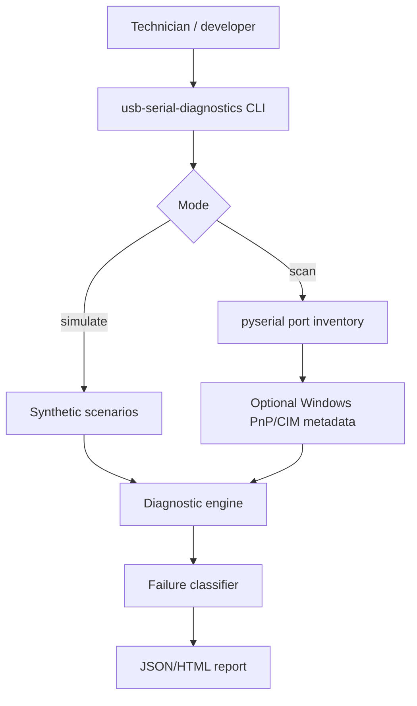

# Architecture

```mermaid
flowchart TD
    User["Technician / developer"] --> CLI["usb-serial-diagnostics CLI"]
    CLI --> Mode{"Mode"}
    Mode -->|"simulate"| Scenarios["Synthetic scenarios"]
    Mode -->|"scan"| Serial["pyserial port inventory"]
    Serial --> PnP["Optional Windows PnP/CIM metadata"]
    Scenarios --> Engine["Diagnostic engine"]
    PnP --> Engine
    Engine --> Classifier["Failure classifier"]
    Classifier --> Report["JSON/HTML report"]
```

The diagnostic engine is deliberately separated from live serial access. That keeps tests deterministic and allows every public example to run in CI without USB hardware.

